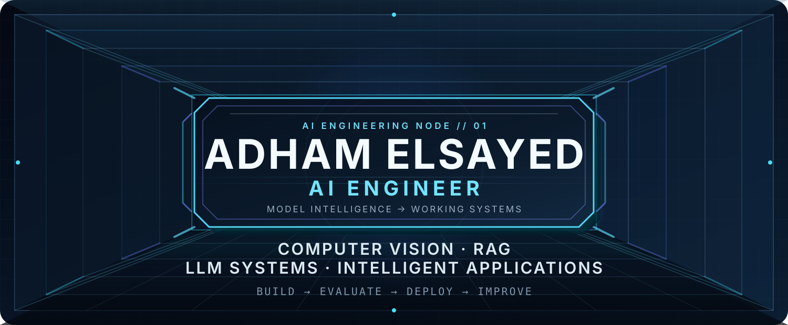
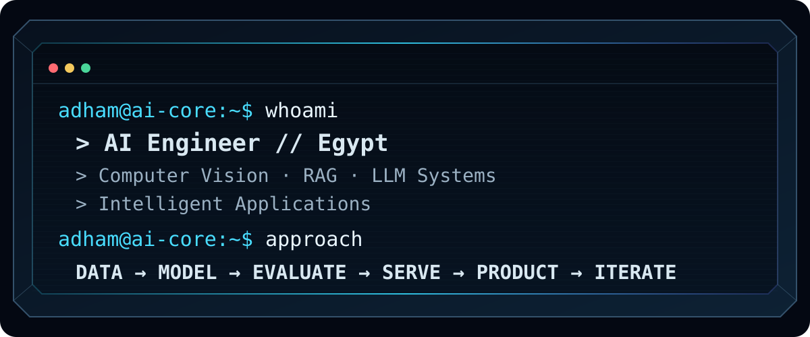
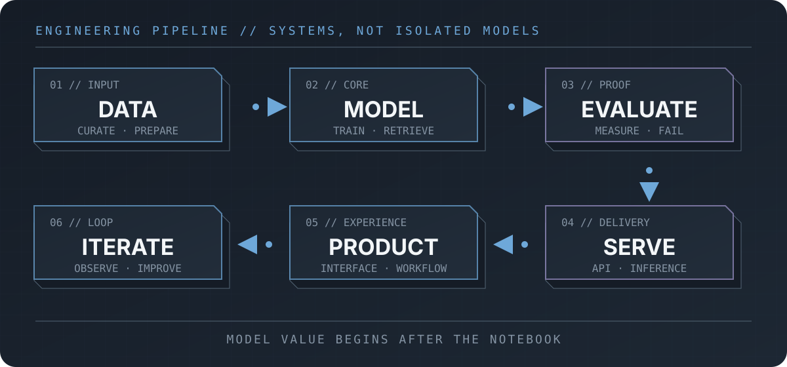
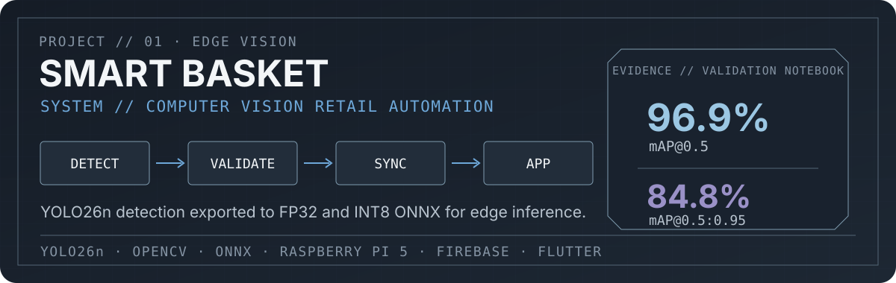
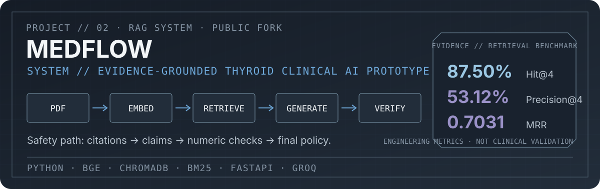
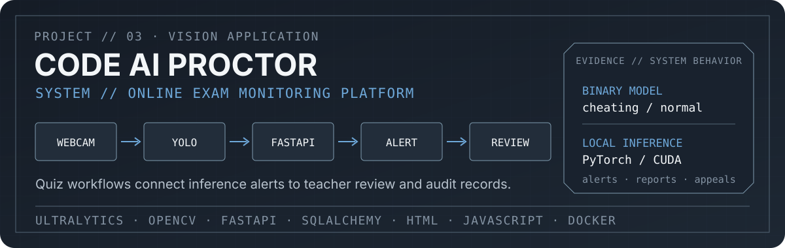
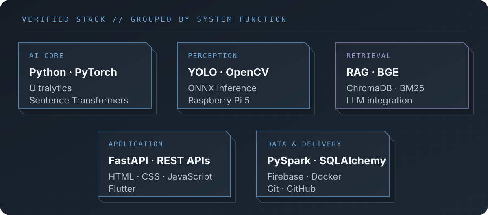
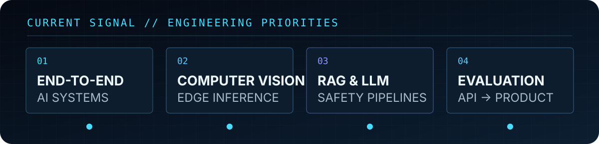

  <picture>
    <source media="(prefers-color-scheme: dark)" srcset="./assets/hero-dark.svg">
    <source media="(prefers-color-scheme: light)" srcset="./assets/hero-light.svg">
    
  </picture>

  <a href="https://adhamelsayedai.github.io/"><code>PORTFOLIO</code></a>
  &nbsp;·&nbsp;
  <a href="#featured-work"><code>PROJECTS</code></a>
  &nbsp;·&nbsp;
  <a href="https://www.linkedin.com/in/adham-elsayed-"><code>LINKEDIN</code></a>
  &nbsp;·&nbsp;
  <a href="https://adhamelsayedai.github.io/Adham_Elsayed_CV.pdf"><code>RÉSUMÉ</code></a>
  &nbsp;·&nbsp;
  <a href="mailto:adhamelsayed515@gmail.com"><code>CONTACT</code></a>

## About

I am an AI Engineer in Egypt building complete systems around models: data, training or retrieval, evaluation, inference, APIs, and usable interfaces. My strongest public work sits at the intersection of computer vision, edge deployment, and evidence-grounded RAG. I care about measured behavior, visible failure modes, and the engineering needed to move beyond notebook-only demos.

## Engineering approach

## Featured work

### 01 // Smart Basket

A retail automation system that detects grocery products, maintains basket state, and synchronizes item data for an application layer.

- Trained a four-class YOLO26n detector at 640 px, then exported a 320 px ONNX model for edge inference.
- Produced FP32 and dynamically quantized INT8 ONNX artifacts; the executed notebook reports approximately 9.7 MB and 2.7 MB respectively.
- Implemented OpenCV inference for desktop and Raspberry Pi 5, with Pi Camera support and Firebase updates when basket state changes.
- Validation output in the committed notebook reports **96.89% mAP@0.5** and **84.79% mAP@0.5:0.95**.

[Inspect the repository →](https://github.com/AdhamElsayedAI/Smart-Basket)

### 02 // MedFlow

An evidence-grounded thyroid clinical AI prototype. This is shown transparently as a **team project and public fork**; Adham is listed in the repository's team section.

- Separates its frozen dense-retrieval benchmark from the product's hybrid dense + BM25 + reciprocal-rank-fusion path.
- Routes evidence through sufficiency checks, grounded generation, citation resolution, claim validation, numeric validation, and a final safety policy.
- The canonical strict passage-level benchmark reports **53.12% Precision@4**, **87.50% Hit@4**, and **MRR ≈ 0.7031**.
- These are internal engineering results—not clinical validation or a medical-accuracy claim.

[Inspect the public fork →](https://github.com/AdhamElsayedAI/Medflow)

### 03 // Code AI Proctor

A self-hosted online-exam monitoring prototype that connects local visual inference to role-based quiz and review workflows.

- Uses a binary YOLO classifier (`cheating` / `normal`) with square center-cropping for webcam frames.
- Sends browser captures to a FastAPI inference endpoint, then records confirmed incidents for teacher review and student appeals.
- Includes organization, teacher, student, class, quiz, grade-export, and notification flows rather than stopping at model inference.
- Supports SQLAlchemy-backed persistence and local PyTorch/CUDA inference, with Docker configuration included.

[Inspect the repository →](https://github.com/AdhamElsayedAI/code-ai-proctor)

Additional public data work: [Telco Customer Churn with PySpark ML](https://github.com/AdhamElsayedAI/Telco-Customer-Churn-Project) and [Student Performance Analysis](https://github.com/AdhamElsayedAI/Student-Performance-Analysis).

## Technical stack

The stack above is limited to technologies represented in the linked public repositories. It is a system map, not a self-rated skill chart.

## System context

- **B.Sc. Artificial Intelligence Engineering** — Mansoura University, expected February 2027.
- **Machine Learning Engineering Trainee** — Digital Egypt Pioneers Initiative, Microsoft AI & Data Science track, September 2025 to July 2026.

## Current signal

  <code>PUBLIC SIGNAL</code>
  &nbsp;·&nbsp;
  <a href="https://github.com/AdhamElsayedAI?tab=repositories">Repositories</a>
  &nbsp;·&nbsp;
  <a href="https://github.com/AdhamElsayedAI">Recent activity</a>

## Open channel

  <a href="https://adhamelsayedai.github.io/">Portfolio</a>
  &nbsp;·&nbsp;
  <a href="https://www.linkedin.com/in/adham-elsayed-">LinkedIn</a>
  &nbsp;·&nbsp;
  <a href="https://adhamelsayedai.github.io/Adham_Elsayed_CV.pdf">Résumé</a>
  &nbsp;·&nbsp;
  <a href="mailto:adhamelsayed515@gmail.com">Email</a>

