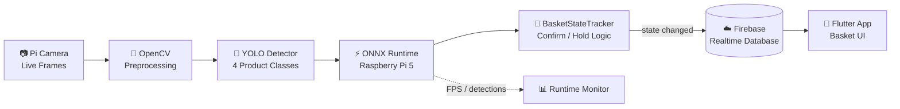
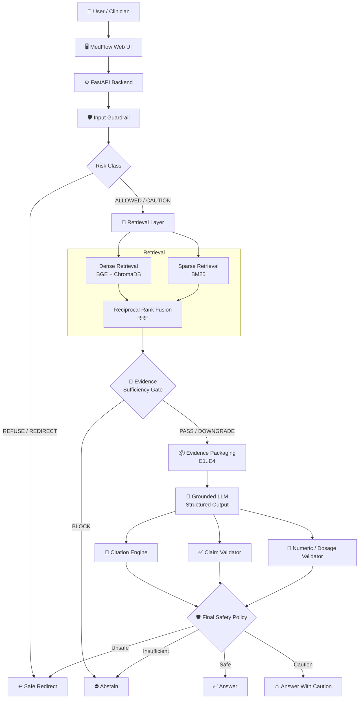
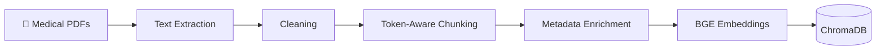
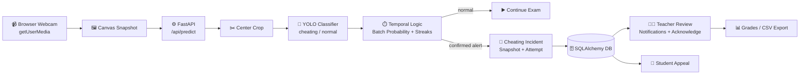
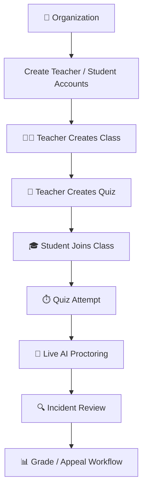
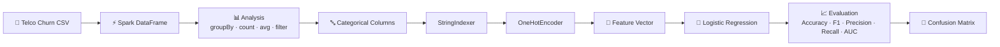
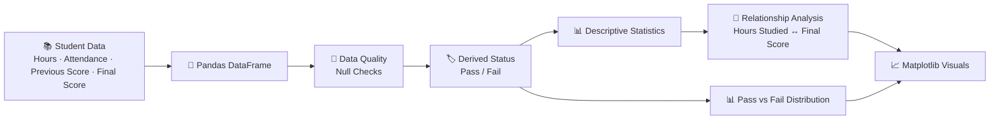

<!-- ═══════════════════════════════════════════════════════════════════════════
     ADHAM ELSAYED — GitHub Profile README · 2026 Edition
═══════════════════════════════════════════════════════════════════════════════ -->

<div align="center">

<a href="https://github.com/AdhamElsayedAI">
  
</a>

<br/>

<a href="https://adhamelsayedai.github.io/"></a>
<a href="https://www.linkedin.com/in/adham-elsayed-"></a>
<a href="https://github.com/AdhamElsayedAI?tab=repositories"></a>
<a href="https://adhamelsayedai.github.io/Adham_Elsayed_CV.pdf"></a>
<a href="mailto:adhamelsayed515@gmail.com"></a>


<sub><b>AI ENGINEER</b> · Computer Vision · RAG / LLM Systems · Edge AI · Evaluation · Intelligent Applications</sub>

</div>

<br/>

## 🧭 About Me

> *"Build the model → measure the behavior → connect the architecture → ship the system."*

I'm an **AI Engineer** building end-to-end intelligent systems across **computer vision**, **edge AI**, **RAG / LLM engineering**, **model evaluation**, and **AI-backed applications**. I care about the full path from model behavior to production workflow — not just notebook results.

```python
class AdhamElsayed:
    name     = "Adham Elsayed"
    role     = "AI Engineer"
    location = "Egypt 🇪🇬"

    expertise = {
        "core": [
            "Computer Vision",
            "RAG / LLM Systems",
            "Model Evaluation",
            "Edge AI",
            "Intelligent Applications",
        ],
        "stack": [
            "Python", "PyTorch", "YOLO", "OpenCV", "ONNX Runtime",
            "FastAPI", "ChromaDB", "Firebase", "SQLAlchemy", "PySpark"
        ],
    }

    current_systems = [
        "🛒 Smart Basket — edge computer vision + synchronized retail state",
        "🩺 MedFlow — evidence-grounded RAG + safety validation",
        "🎥 Code AI Proctor — visual inference + auditable exam workflow",
    ]

    engineering_loop = "Data → Model → Evaluate → Serve → Product → Iterate"
    philosophy       = "Models are components. The system is the product."

    def say_hi(self):
        print("Thanks for visiting — inspect the architecture, not just the headline.")
```

<br/>

## 📌 Quick Navigation

<div align="center">

| | Section | Jump |
|:---:|:---|:---|
| 🔥 | **Featured Systems** | [Smart Basket](#-1-smart-basket--edge-ai-retail-system) · [MedFlow](#-2-medflow--evidence-grounded-clinical-rag) · [Code AI Proctor](#-3-code-ai-proctor--ai-exam-monitoring-platform) |
| 📊 | **Data / ML Projects** | [Telco Churn](#-4-telco-customer-churn--pyspark-ml) · [Student Performance](#-5-student-performance-analysis) |
| 🧠 | **Technical Skills** | [AI / ML](#-core-ai--ml) · [Vision](#-computer-vision--edge-ai) · [RAG](#-rag--llm-engineering) · [Backend](#-backend--data-systems) |
| 📈 | **Evidence** | [Evaluation](#-evaluation--evidence) · [GitHub Stats](#-github-stats) |
| 🎯 | **Now** | [Current Focus](#-current-focus) |

</div>

<br/>

---

# 🔥 Featured Systems

---

## 👁️ 1. Smart Basket — *Edge AI Retail System*

> **Real-time retail product recognition** running on Raspberry Pi 5, connected to basket-state logic, Firebase synchronization, and a Flutter application.

<table>
<tr><td><b>🔗 Repository</b></td><td><a href="https://github.com/AdhamElsayedAI/Smart-Basket"><code>Smart-Basket</code></a></td></tr>
<tr><td><b>📦 Stack</b></td><td><code>YOLO</code> · <code>OpenCV</code> · <code>ONNX Runtime</code> · <code>Raspberry Pi 5</code> · <code>Firebase</code> · <code>Flutter</code></td></tr>
<tr><td><b>🎯 Capability</b></td><td>Edge product detection + stabilized basket state + mobile synchronization</td></tr>
<tr><td><b>📊 Validation</b></td><td><code>mAP@0.5 = 96.89%</code> · <code>mAP@0.5:0.95 = 84.79%</code></td></tr>
</table>

### 🏗️ System Architecture



**Architecture highlights**

- 📷 Camera frames are prepared with OpenCV before inference.
- ⚡ ONNX Runtime moves inference onto Raspberry Pi 5 rather than depending on a cloud model endpoint.
- 🧠 Basket-state confirmation / hold behavior reduces unstable product-state changes.
- ☁️ Firebase updates are pushed when state changes instead of continuously rewriting identical state.
- 📱 Flutter consumes the synchronized state at the application layer.

[**→ Inspect Smart Basket**](https://github.com/AdhamElsayedAI/Smart-Basket)

---

## 🩺 2. MedFlow — *Evidence-Grounded Clinical RAG*

> A thyroid-focused clinical AI prototype where **retrieval, evidence sufficiency, generation, citation resolution, claim validation, numeric safety, and final policy are separate system layers**.

<table>
<tr><td><b>🔗 Repository</b></td><td><a href="https://github.com/AdhamElsayedAI/Medflow"><code>Medflow</code></a></td></tr>
<tr><td><b>📦 Stack</b></td><td><code>FastAPI</code> · <code>BGE</code> · <code>ChromaDB</code> · <code>BM25</code> · <code>RRF</code> · <code>Groq / GPT-OSS</code></td></tr>
<tr><td><b>🎯 Capability</b></td><td>Evidence-grounded answers with traceable citations and explicit safety routing</td></tr>
<tr><td><b>📊 Retrieval</b></td><td><code>Precision@4 = 53.12%</code> · <code>Hit@4 = 87.50%</code> · <code>MRR ≈ 0.7031</code></td></tr>
</table>

### 🏗️ High-Level Architecture



### 📚 Offline Evidence Pipeline



**Architecture highlights**

- 🔎 Dense and sparse retrieval are modeled separately before fusion.
- 🚦 Evidence sufficiency can stop generation before the LLM is allowed to answer.
- 🧾 Citation resolution is deterministic and separate from claim support.
- 🔢 Numbers, units, dosages, thresholds, and durations receive stricter validation.
- 🛡️ The final policy can **answer, caution, abstain, or redirect**.

> The reported metrics are **engineering evaluation metrics**, not clinical validation or a medical-accuracy claim.

[**→ Inspect MedFlow**](https://github.com/AdhamElsayedAI/Medflow)

---

## 🎥 3. Code AI Proctor — *AI Exam Monitoring Platform*

> A self-hosted exam platform that connects **webcam inference** to organization management, quizzes, incident persistence, teacher review, grading, and student appeals.

<table>
<tr><td><b>🔗 Repository</b></td><td><a href="https://github.com/AdhamElsayedAI/code-ai-proctor"><code>code-ai-proctor</code></a></td></tr>
<tr><td><b>📦 Stack</b></td><td><code>YOLO</code> · <code>PyTorch</code> · <code>FastAPI</code> · <code>SQLAlchemy</code> · <code>HTML/CSS/JS</code></td></tr>
<tr><td><b>🎯 Capability</b></td><td>Local visual inference connected to an auditable exam workflow</td></tr>
<tr><td><b>🧠 AI Task</b></td><td>Binary classification: <code>cheating</code> vs <code>normal</code></td></tr>
</table>

### 🏗️ Runtime Architecture



### 🧩 Platform Workflow



**Architecture highlights**

- 🧠 YOLO inference runs locally with CUDA when available and CPU fallback otherwise.
- ✂️ Webcam frames are center-cropped before classification to avoid aspect-ratio distortion.
- ⏱️ Batch probability and streak logic avoid treating a single unstable frame as a final incident.
- 🚨 Confirmed alerts are tied to the active quiz attempt and stored for review.
- 👨‍🏫 Teacher notifications, incident acknowledgement, grading, CSV export, and student appeals extend the system far beyond inference.

[**→ Inspect Code AI Proctor**](https://github.com/AdhamElsayedAI/code-ai-proctor)

---

# 📊 Data / Machine Learning Projects

---

## 📡 4. Telco Customer Churn — *PySpark ML*

> Big-data style churn analysis and binary classification using **Spark DataFrames + MLlib**.

<table>
<tr><td><b>🔗 Repository</b></td><td><a href="https://github.com/AdhamElsayedAI/Telco-Customer-Churn-Project"><code>Telco-Customer-Churn-Project</code></a></td></tr>
<tr><td><b>📦 Stack</b></td><td><code>PySpark</code> · <code>Spark DataFrames</code> · <code>MLlib</code> · <code>Google Colab</code></td></tr>
<tr><td><b>🎯 Task</b></td><td>Predict whether a telecom customer will churn</td></tr>
<tr><td><b>🧠 Model</b></td><td><code>Logistic Regression</code></td></tr>
</table>

### 🏗️ ML Pipeline Architecture



**Architecture highlights**

- ⚡ Uses Spark DataFrames for aggregation and churn analysis.
- 🔤 String categorical features are converted using `StringIndexer` and `OneHotEncoder`.
- 🧠 Logistic Regression matches the binary churn target.
- 📈 Evaluation covers classification quality through Accuracy, F1, Precision, Recall, AUC, and a confusion matrix.

[**→ Inspect Telco Churn**](https://github.com/AdhamElsayedAI/Telco-Customer-Churn-Project)

---

## 🎓 5. Student Performance Analysis

> A compact exploratory analysis notebook connecting study behavior, attendance, previous performance, final score, and pass/fail status.

<table>
<tr><td><b>🔗 Repository</b></td><td><a href="https://github.com/AdhamElsayedAI/Student-Performance-Analysis"><code>Student-Performance-Analysis</code></a></td></tr>
<tr><td><b>📦 Stack</b></td><td><code>Python</code> · <code>Pandas</code> · <code>Matplotlib</code> · <code>Google Colab</code></td></tr>
<tr><td><b>🎯 Focus</b></td><td>Exploratory student-performance analysis and visualization</td></tr>
</table>

### 🏗️ Analysis Architecture



**Architecture highlights**

- 🐼 Builds the analysis around a structured Pandas DataFrame.
- 🧹 Explicit null checking precedes the derived analysis.
- 🏷️ Final score is transformed into a `Pass` / `Fail` status for categorical analysis.
- 📊 Descriptive statistics and visual analysis are separated from data preparation.
- 📈 Matplotlib is used for relationship and distribution views.

[**→ Inspect Student Performance Analysis**](https://github.com/AdhamElsayedAI/Student-Performance-Analysis)

---

# 🚀 Technical Skills

## 🧠 Core AI / ML

| Capability | Evidence in public work |
|:---|:---|
| **Model Training & Evaluation** | YOLO validation · retrieval benchmarks · classification evaluation |
| **Deep Learning** | YOLO / PyTorch-based vision systems |
| **Model Optimization** | ONNX export and Raspberry Pi inference |
| **Evaluation-First Development** | mAP · Precision@K · Hit@K · MRR · guardrail / safety tests |
| **Big Data ML** | PySpark DataFrames + MLlib churn pipeline |

---

## 👁️ Computer Vision & Edge AI

`YOLO` · `PyTorch` · `OpenCV` · `ONNX Runtime` · `Raspberry Pi 5` · `Pi Camera`

**Applied in:** Smart Basket · Code AI Proctor

---

## 🔗 RAG / LLM Engineering

`BGE Embeddings` · `ChromaDB` · `BM25` · `RRF` · `Grounded Generation` · `Citation Resolution` · `Claim Validation` · `Numeric Safety` · `Guardrails`

**Applied in:** MedFlow

---

## ⚙️ Backend & Data Systems

`FastAPI` · `REST APIs` · `SQLAlchemy` · `Firebase` · `PySpark` · `Spark MLlib` · `Pandas` · `SQLite / SQL`

---

## 🖥️ Application Layer

`HTML` · `CSS` · `JavaScript` · `Flutter`

---

# 📐 Engineering Principles

```text
01  Understand the failure mode before adding complexity.
02  Measure behavior before calling a component better.
03  Tie every metric to its exact evaluation context.
04  Separate retrieval, generation, validation, and product workflow.
05  Prefer inspectable architecture over black-box demos.
06  Move notebook → inference → API → product.
```

---

# 📈 Evaluation & Evidence

| Project | Measured / Inspectable Evidence |
|:---|:---|
| **Smart Basket** | `mAP@0.5 = 96.89%` · `mAP@0.5:0.95 = 84.79%` |
| **MedFlow** | `Precision@4 = 53.12%` · `Hit@4 = 87.50%` · `MRR ≈ 0.7031` |
| **Code AI Proctor** | Local inference · temporal stabilization · incident persistence · review workflow |
| **Telco Churn** | Accuracy · F1 · Precision · Recall · AUC · Confusion Matrix |
| **Student Performance** | Descriptive statistics · relationship analysis · pass/fail visualization |

---

# 🎓 Background

| | |
|:---|:---|
| **Education** | B.Sc. Artificial Intelligence Engineering — Mansoura University |
| **Training** | Digital Egypt Pioneers Initiative — Microsoft AI & Data Science / Machine Learning Engineering track |
| **Location** | Egypt 🇪🇬 |

---

# 📊 GitHub Stats

<div align="center">


<br/>


</div>

---

# 🎯 Current Focus

```text
╔══════════════════════════════════════════════════════════════════════════════╗
║                         CURRENT ENGINEERING FOCUS                           ║
╠══════════════════════════════════════════════════════════════════════════════╣
║                                                                              ║
║  👁️  Computer Vision & Edge AI                                              ║
║      ├── detection / classification systems                                  ║
║      ├── efficient local inference                                           ║
║      └── model → device → application integration                            ║
║                                                                              ║
║  🔗  RAG / LLM Systems                                                       ║
║      ├── retrieval quality and evidence sufficiency                          ║
║      ├── grounding / citation / claim validation                             ║
║      └── safety, abstention, and refusal behavior                            ║
║                                                                              ║
║  📊  Evaluation                                                              ║
║      ├── measurable system behavior                                          ║
║      └── failure-mode driven iteration                                       ║
║                                                                              ║
║  ⚙️  AI Product Engineering                                                  ║
║      └── model → API → workflow → usable product                             ║
║                                                                              ║
╚══════════════════════════════════════════════════════════════════════════════╝
```

---

<div align="center">

**Adham Elsayed** · AI Engineer · Egypt 🇪🇬  

[Portfolio](https://adhamelsayedai.github.io/) · [LinkedIn](https://www.linkedin.com/in/adham-elsayed-) · [Résumé](https://adhamelsayedai.github.io/Adham_Elsayed_CV.pdf) · [Email](mailto:adhamelsayed515@gmail.com)

<br/>

⚡ **Build the model · Measure the behavior · Ship the system**


</div>
