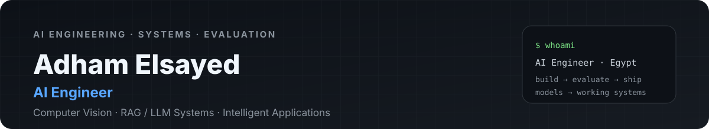
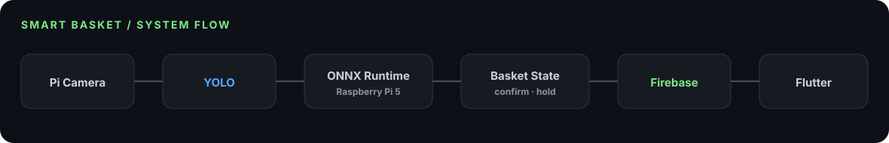
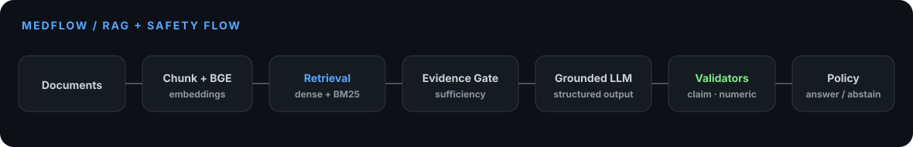
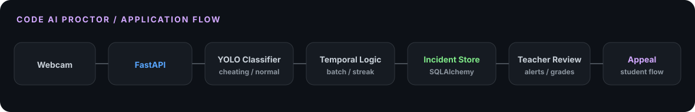

<p align="center">
  
</p>

<p align="center">
  <a href="https://adhamelsayedai.github.io/"><b>Portfolio</b></a>
  &nbsp;·&nbsp;
  <a href="#-featured-projects"><b>Projects</b></a>
  &nbsp;·&nbsp;
  <a href="#-technical-skills"><b>Skills</b></a>
  &nbsp;·&nbsp;
  <a href="https://www.linkedin.com/in/adham-elsayed-"><b>LinkedIn</b></a>
  &nbsp;·&nbsp;
  <a href="mailto:adhamelsayed515@gmail.com"><b>Contact</b></a>
</p>

## 🧭 About Me

> *"Build the model. Measure the behavior. Connect it to a system people can actually use."*

I'm an **AI Engineer** focused on turning models into complete working systems. My public work spans **computer vision**, **edge inference**, **RAG / LLM systems**, **evaluation**, and **AI-backed applications** — with a strong bias toward measurable behavior, transparent architecture, and practical deployment.

```python
class AdhamElsayed:
    name = "Adham Elsayed"
    role = "AI Engineer"
    location = "Egypt 🇪🇬"

    focus = [
        "Computer Vision",
        "RAG / LLM Systems",
        "Model Evaluation",
        "Edge AI",
        "Intelligent Applications",
    ]

    engineering_loop = "Data → Model → Evaluate → Serve → Product → Iterate"

    strongest_public_systems = [
        "Smart Basket",
        "MedFlow",
        "Code AI Proctor",
    ]

    def principle(self):
        return "Models are components. The system is the product."
```

## 📌 Quick Navigation

| | Section | Jump |
|---|---|---|
| 🔥 | **Featured Projects** | [Smart Basket](#-1-smart-basket--edge-ai-retail-system) · [MedFlow](#-2-medflow--evidence-grounded-rag-system) · [Code AI Proctor](#-3-code-ai-proctor--ai-proctoring-platform) |
| 🧠 | **Technical Skills** | [AI / ML](#-ai--machine-learning) · [Computer Vision](#-computer-vision--edge-ai) · [RAG / LLM](#-rag--llm-engineering) · [Applications](#-backend--applications) |
| ⚙️ | **Engineering Mindset** | [System Design](#-engineering-principles) · [Evaluation](#-evaluation--evidence) |
| 🎯 | **Current Focus** | [Now](#-current-focus) |

---

## 🔥 Featured Projects

### 👁️ 1. Smart Basket — *Edge AI Retail System*

> Real-time retail product recognition with **YOLO + ONNX + Raspberry Pi 5**, connected to synchronized basket state and a mobile application layer.

| | |
|---|---|
| **🔗 Repository** | [`Smart-Basket`](https://github.com/AdhamElsayedAI/Smart-Basket) |
| **📦 Core Stack** | `YOLO` · `OpenCV` · `ONNX Runtime` · `Raspberry Pi 5` · `Firebase` · `Flutter` |
| **🎯 System Goal** | Detect products at the edge, stabilize basket state, synchronize changes to the app |
| **📊 Validation** | **`mAP@0.5 = 96.89%`** · **`mAP@0.5:0.95 = 84.79%`** |



**Architecture highlights**

- 📷 **Pi Camera → YOLO** for live grocery-product detection.
- ⚡ **ONNX Runtime on Raspberry Pi 5** for CPU edge inference.
- 🧠 `BasketStateTracker` uses confirm/hold behavior to reduce unstable item-state changes.
- ☁️ Firebase updates are pushed **only when basket state changes**, keeping synchronization purposeful.
- 📱 Flutter represents the application layer consuming the synchronized basket state.

**Engineering evidence**

- Four retail classes are defined in the Raspberry Pi implementation.
- The Pi pipeline supports letterbox preprocessing, multiple ONNX output formats, vectorized NMS, warm-up, FPS display, and graceful shutdown.
- Validation metrics come from the committed project evaluation output rather than a self-rating.

[**→ Inspect Smart Basket**](https://github.com/AdhamElsayedAI/Smart-Basket)

---

### 🩺 2. MedFlow — *Evidence-Grounded RAG System*

> A thyroid-focused clinical AI prototype where retrieval, evidence sufficiency, citations, claims, numeric safety, and final answer policy are treated as separate engineering problems.

| | |
|---|---|
| **🔗 Repository** | [`Medflow`](https://github.com/AdhamElsayedAI/Medflow) |
| **📦 Core Stack** | `FastAPI` · `BGE` · `ChromaDB` · `BM25` · `RRF` · `Groq / GPT-OSS` |
| **🎯 System Goal** | Evidence-grounded answers with traceable citations and explicit safety routing |
| **📊 Canonical Retrieval** | **`Precision@4 = 53.12%`** · **`Hit@4 = 87.50%`** · **`MRR ≈ 0.7031`** |



**Architecture highlights**

- 📄 Medical PDFs are extracted, cleaned, token-chunked, enriched with metadata, embedded, and indexed.
- 🔎 The documented product path combines **dense retrieval + BM25** with reciprocal-rank fusion.
- 🚦 An **Evidence Sufficiency Gate** can pass, downgrade, or block generation.
- 🧾 Citation IDs are resolved independently from claim support — a citation existing does not automatically mean the claim is supported.
- 🛡️ Claim, citation, numeric/dosage, and final-policy layers are separated rather than delegated blindly to the LLM.

**Evaluation & evidence**

| Benchmark | Result |
|---|---:|
| **Precision@4** | **53.12%** |
| **Hit@4** | **87.50%** |
| **MRR** | **≈ 0.7031** |
| Citation ID Validity — Day 3 internal eval | **100%** |
| Fabricated Citations — Day 3 internal eval | **0** |
| Negative-case Abstention — Day 3 internal eval | **3 / 3** |

> These are **engineering evaluation metrics**, not proof of clinical accuracy or clinical validation.

MedFlow is a **team project / public fork**, and the repository documents the team and system architecture openly.

[**→ Inspect MedFlow**](https://github.com/AdhamElsayedAI/Medflow)

---

### 🎥 3. Code AI Proctor — *AI Proctoring Platform*

> A self-hosted exam-monitoring system where visual inference is only one component of a larger workflow: authentication, quizzes, alerts, persistence, teacher review, grading, and appeals.

| | |
|---|---|
| **🔗 Repository** | [`code-ai-proctor`](https://github.com/AdhamElsayedAI/code-ai-proctor) |
| **📦 Core Stack** | `YOLO` · `PyTorch` · `FastAPI` · `SQLAlchemy` · `HTML/CSS/JS` |
| **🎯 System Goal** | Connect webcam inference to auditable exam and incident-review workflows |
| **🧠 AI Task** | Binary classification: `cheating` vs `normal` |



**Architecture highlights**

- 📹 Browser webcam frames are captured during active quizzes and sent to `/api/predict`.
- 🧠 A local YOLO classifier performs `cheating` / `normal` inference with CPU fallback when CUDA is unavailable.
- ⏱️ Batch probability + streak logic improves temporal stability instead of trusting a single frame.
- 🚨 Confirmed alerts create incidents tied to active exam attempts and snapshots.
- 👨‍🏫 Teachers review incidents, notifications, grades, and CSV exports; students can submit appeals.
- 🗄️ SQLAlchemy provides the persistence layer for users, quizzes, attempts, predictions, and incidents.

[**→ Inspect Code AI Proctor**](https://github.com/AdhamElsayedAI/code-ai-proctor)

---

<details>
<summary><b>🦿 More public work</b></summary>
<br>

| Project | Focus | Repository |
|---|---|---|
| **Telco Customer Churn** | Data / ML analysis | [`Telco-Customer-Churn-Project`](https://github.com/AdhamElsayedAI/Telco-Customer-Churn-Project) |
| **Student Performance Analysis** | Exploratory data analysis / notebook workflow | [`Student-Performance-Analysis`](https://github.com/AdhamElsayedAI/Student-Performance-Analysis) |

</details>

---

## 🚀 Technical Skills

### 🧠 AI & Machine Learning

| Area | Evidence in public work |
|---|---|
| **Model training & evaluation** | YOLO validation, retrieval benchmarks, system-level test metrics |
| **Deep learning** | PyTorch / TensorFlow-based project work |
| **Model optimization** | ONNX export and Raspberry Pi edge inference |
| **Evaluation-first development** | Retrieval precision / hit rate / MRR, guardrail and safety evaluation |

### 👁️ Computer Vision & Edge AI

`YOLO` · `OpenCV` · `ONNX Runtime` · `PyTorch` · `Raspberry Pi 5` · `Pi Camera`

**Applied in:** Smart Basket and Code AI Proctor.

### 🔗 RAG & LLM Engineering

`BGE Embeddings` · `ChromaDB` · `BM25` · `Reciprocal Rank Fusion` · `Grounded Generation` · `Citation Resolution` · `Claim Validation` · `Safety Guardrails`

**Applied in:** MedFlow.

### ⚙️ Backend & Applications

`FastAPI` · `REST APIs` · `SQLAlchemy` · `Firebase` · `HTML` · `CSS` · `JavaScript` · `Flutter`

### 🗃️ Data & Tooling

`Python` · `NumPy` · `Git` · `GitHub` · `Docker` · `SQLite / SQL`

---

## 🧩 Engineering Principles

```text
01  Understand the failure mode before adding complexity.
02  Measure behavior before calling a component "better".
03  Keep model metrics tied to the exact evaluation context.
04  Treat retrieval, generation, validation, and product workflow as separate layers.
05  Prefer architecture that can be inspected over black-box demos.
06  Move from notebook → inference → API → product, not notebook → screenshot.
```

### 📐 The system loop I aim for

```text
DATA
  ↓
MODEL / RETRIEVAL
  ↓
EVALUATION
  ↓
INFERENCE / API
  ↓
PRODUCT WORKFLOW
  ↓
OBSERVATION
  ↓
ITERATE
```

---

## 📊 Evaluation & Evidence

I prefer showing **what was measured** and **under what conditions** rather than using generic skill percentages.

| Project | Evidence |
|---|---|
| **Smart Basket** | `mAP@0.5 = 96.89%` · `mAP@0.5:0.95 = 84.79%` |
| **MedFlow** | `Precision@4 = 53.12%` · `Hit@4 = 87.50%` · `MRR ≈ 0.7031` |
| **Code AI Proctor** | Temporal batching, persisted incidents, review workflow, explicit inference threshold behavior |

---

## 🎓 Background

| | |
|---|---|
| **Education** | B.Sc. Artificial Intelligence Engineering — Mansoura University |
| **Training** | Digital Egypt Pioneers Initiative — Microsoft AI & Data Science / Machine Learning Engineering track |
| **Location** | Egypt 🇪🇬 |

---

## 🎯 Current Focus

```text
╔══════════════════════════════════════════════════════════════════════╗
║                       CURRENT ENGINEERING FOCUS                     ║
╠══════════════════════════════════════════════════════════════════════╣
║                                                                      ║
║  👁️  Computer Vision & Edge AI                                      ║
║      ├── efficient inference pipelines                               ║
║      ├── detection / classification systems                          ║
║      └── model → device → application integration                     ║
║                                                                      ║
║  🔗  RAG / LLM Systems                                               ║
║      ├── retrieval quality                                           ║
║      ├── grounding / citation validation                             ║
║      └── safety and refusal behavior                                 ║
║                                                                      ║
║  📊  Evaluation                                                      ║
║      ├── measurable system behavior                                  ║
║      └── failure-mode driven iteration                               ║
║                                                                      ║
║  ⚙️  AI Product Engineering                                         ║
║      └── model → API → workflow → usable product                     ║
║                                                                      ║
╚══════════════════════════════════════════════════════════════════════╝
```

---

## 🤝 Connect

<p align="center">
  <a href="https://adhamelsayedai.github.io/">Portfolio</a>
  &nbsp;·&nbsp;
  <a href="https://www.linkedin.com/in/adham-elsayed-">LinkedIn</a>
  &nbsp;·&nbsp;
  <a href="https://adhamelsayedai.github.io/Adham_Elsayed_CV.pdf">Résumé</a>
  &nbsp;·&nbsp;
  <a href="mailto:adhamelsayed515@gmail.com">Email</a>
</p>

<p align="center">
  <b>Adham Elsayed</b> · AI Engineer<br>
  <sub>Build the model. Measure the behavior. Ship the system.</sub>
</p>
