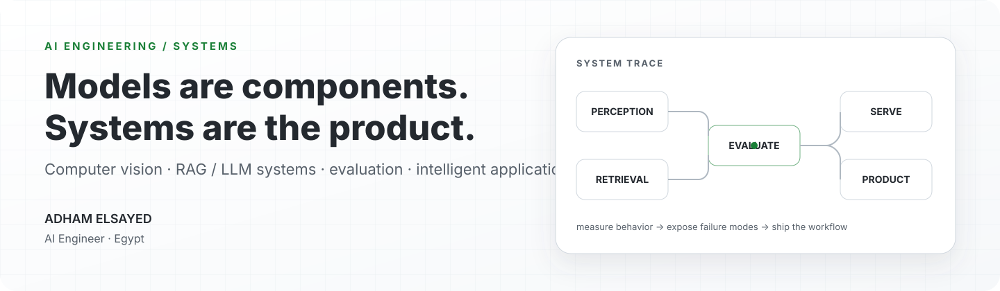
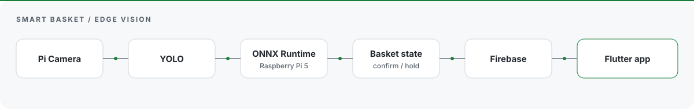
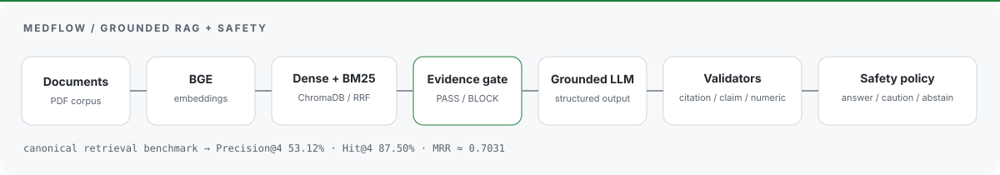
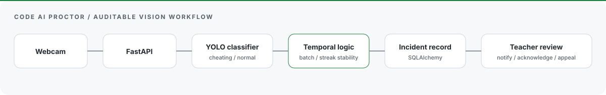

### Adham Elsayed

**AI Engineer** — computer vision, RAG / LLM systems, evaluation, and intelligent applications.

I build end-to-end AI systems where model behavior is measured, failure modes are visible, and the model is connected to a real workflow.

[Portfolio](https://adhamelsayedai.github.io/) · [LinkedIn](https://www.linkedin.com/in/adham-elsayed-) · [Résumé](https://adhamelsayedai.github.io/Adham_Elsayed_CV.pdf) · [Email](mailto:adhamelsayed515@gmail.com)

<picture>
  <source media="(prefers-color-scheme: dark)" srcset="./assets/profile-hero-dark.svg">
  <source media="(prefers-color-scheme: light)" srcset="./assets/profile-hero-light.svg">
  
</picture>

---

## Selected systems

### [Smart Basket](https://github.com/AdhamElsayedAI/Smart-Basket) — edge computer vision for retail state

A smart-shopping system that turns camera detections into a stable basket state and synchronizes that state to an application layer.

- **System:** Pi Camera → YOLO detector → ONNX Runtime on Raspberry Pi 5 → basket-state tracker → Firebase → Flutter.
- **Edge engineering:** OpenCV inference, Pi Camera support, CPU execution, and Firebase updates only when basket state changes.
- **Measured result:** **`mAP@0.5 = 96.89%`** and **`mAP@0.5:0.95 = 84.79%`** in the committed validation output.

[Repository →](https://github.com/AdhamElsayedAI/Smart-Basket)

---

### [MedFlow](https://github.com/AdhamElsayedAI/Medflow) — evidence-grounded RAG with explicit safety gates

A thyroid-focused clinical AI prototype built around a stricter idea than “retrieve and generate”: evidence sufficiency, citation resolution, claim support, numeric validation, and a final safety policy are separate system concerns.

- **Retrieval core:** BGE-small embeddings + ChromaDB, with a product hybrid path that also uses BM25 and reciprocal-rank fusion.
- **Safety path:** evidence gate → grounded structured generation → citation / claim / numeric validators → answer, caution, abstain, or redirect.
- **Canonical retrieval benchmark:** **`Precision@4 = 53.12%`**, **`Hit@4 = 87.50%`**, **`MRR ≈ 0.7031`**.
- These are **engineering benchmark results, not clinical validation**. MedFlow is a **team project / public fork**, with Adham listed in the repository team.

[Repository →](https://github.com/AdhamElsayedAI/Medflow)

---

### [Code AI Proctor](https://github.com/AdhamElsayedAI/code-ai-proctor) — visual inference connected to an auditable exam workflow

A self-hosted online-exam platform where local vision inference is only one part of the system; the rest is exam state, incident persistence, teacher review, and student appeals.

- **Inference:** browser webcam capture → FastAPI → local YOLO classification (`cheating` / `normal`).
- **Stability:** batch / streak logic reduces single-frame instability before a formal alert is recorded.
- **Workflow:** organization, teacher, student, quiz, incident, notification, grade-export, and appeal flows.
- **Persistence:** SQLAlchemy-backed records and incident snapshots; local PyTorch/CUDA inference with CPU fallback behavior.

[Repository →](https://github.com/AdhamElsayedAI/code-ai-proctor)

---

## How I approach AI engineering

- **Treat the model as a component, not the product.** Data flow, inference, APIs, persistence, and user workflow matter just as much.
- **Measure before adding complexity.** Retrieval quality, threshold behavior, failure cases, and latency should decide what stays in the system.
- **Keep evidence visible.** Metrics belong next to the exact configuration they describe; safety and validation claims should be explicit about their scope.

---

## Tools I reach for

**AI / ML** — `Python` · `PyTorch` · `TensorFlow` · `scikit-learn`  
**Computer vision / edge** — `YOLO` · `OpenCV` · `ONNX Runtime` · `Raspberry Pi`  
**RAG / LLM systems** — `BGE` · `ChromaDB` · `BM25` · `RRF` · structured LLM APIs  
**Application / data** — `FastAPI` · `REST` · `Firebase` · `SQLAlchemy` · `SQLite / SQL` · `Flutter`  
**Delivery** — `Git` · `GitHub` · `Docker` · `Linux`

---

## Background

- **B.Sc. Artificial Intelligence Engineering** — Mansoura University.
- **Digital Egypt Pioneers Initiative** — Microsoft AI & Data Science / Machine Learning Engineering track.

<strong>More public work</strong>

 

- [Telco Customer Churn with PySpark ML](https://github.com/AdhamElsayedAI/Telco-Customer-Churn-Project)
- [Student Performance Analysis](https://github.com/AdhamElsayedAI/Student-Performance-Analysis)

---

### Current focus

Production-shaped AI systems · computer vision at the edge · grounded RAG / LLM engineering · evaluation · AI product engineering

**Open to:** AI / ML engineering internships, graduate roles, and technically serious collaborations.

[Portfolio](https://adhamelsayedai.github.io/) · [LinkedIn](https://www.linkedin.com/in/adham-elsayed-) · [Email](mailto:adhamelsayed515@gmail.com)
