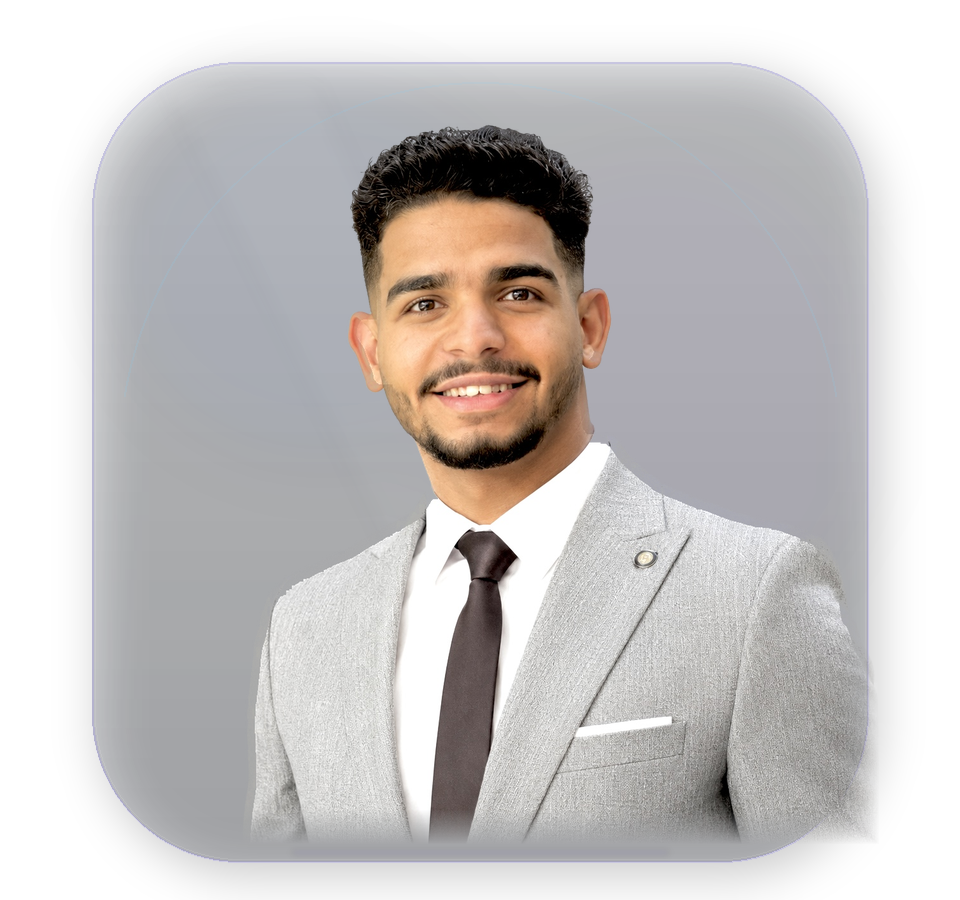
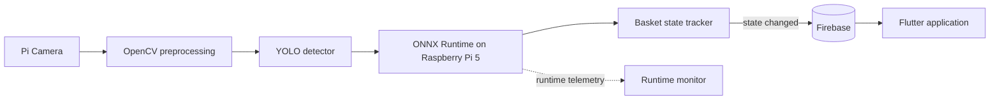
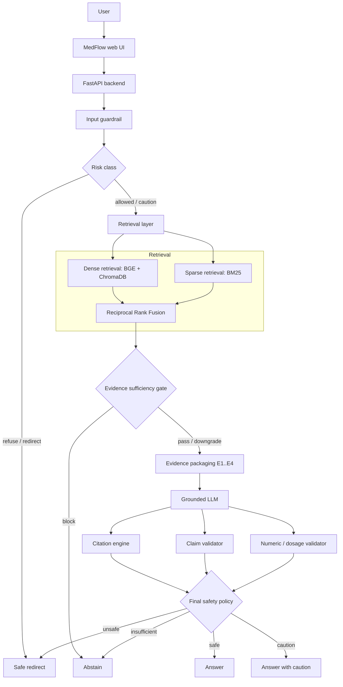
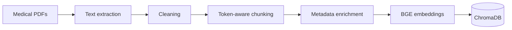
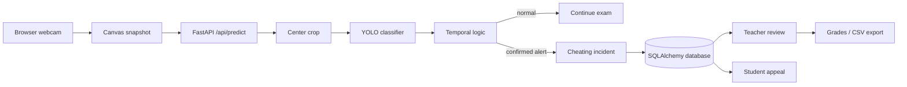
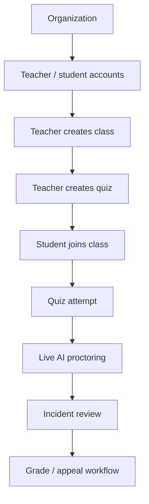
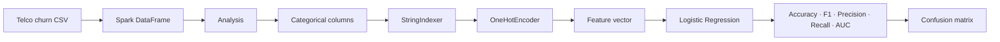
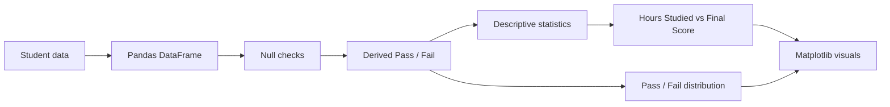

<div align="center">




<br/>

[](https://adhamelsayedai.github.io/)
[](https://www.linkedin.com/in/adham-elsayed-)
[](https://github.com/AdhamElsayedAI)
[](https://adhamelsayedai.github.io/Adham_Elsayed_CV.pdf)

<sub>Computer Vision · Edge AI · RAG / LLM Systems · Model Evaluation</sub>

</div>

---

## 🧭 About Me

> *Build the model → measure the behavior → connect the architecture → ship the system.*

I'm an **AI Engineer** focused on turning models into complete, inspectable systems. My work spans **computer vision, edge deployment, RAG / LLM engineering, model evaluation, APIs, data pipelines, and intelligent applications**.

```python
class AdhamElsayed:
    role = "AI Engineer"
    location = "Egypt"

    focus = [
        "Computer Vision",
        "Edge AI",
        "RAG / LLM Systems",
        "Model Evaluation",
        "Intelligent Applications",
    ]

    systems = {
        "Smart Basket": "edge vision + synchronized retail state",
        "MedFlow": "evidence-grounded RAG + safety validation",
        "Code AI Proctor": "visual inference + auditable exam workflow",
    }

    engineering_loop = "Data → Model → Evaluate → Serve → Product → Iterate"
```

<p align="center">
  <a href="#-featured-systems"><b>Featured Systems</b></a> ·
  <a href="#-core-skills"><b>Core Skills</b></a> ·
  <a href="#-tech-stack"><b>Tech Stack</b></a> ·
  <a href="#-evaluation--evidence"><b>Evidence</b></a> ·
  <a href="#-connect-with-me"><b>Contact</b></a>
</p>

---

# 🔥 Featured Systems

## 👁️ 1. Smart Basket — Edge AI Retail System

Real-time retail product recognition running on **Raspberry Pi 5**, connected to basket-state logic, Firebase synchronization, and a Flutter application.

| | |
|---|---|
| **Repository** | [`Smart-Basket`](https://github.com/AdhamElsayedAI/Smart-Basket) |
| **Stack** | `YOLO` · `OpenCV` · `ONNX Runtime` · `Raspberry Pi 5` · `Firebase` · `Flutter` |
| **Capability** | Edge product detection + stabilized basket state + mobile synchronization |
| **Validation** | `mAP@0.5 = 96.89%` · `mAP@0.5:0.95 = 84.79%` |

### 🏗️ System Architecture



**Architecture notes**

- Camera frames are prepared before inference with OpenCV.
- ONNX Runtime moves inference onto Raspberry Pi 5 instead of depending on a cloud model endpoint.
- Basket-state confirmation / hold behavior reduces unstable product-state changes.
- Firebase updates are written when state changes rather than continuously rewriting identical state.
- Flutter consumes the synchronized basket state at the application layer.

[**Inspect Smart Basket →**](https://github.com/AdhamElsayedAI/Smart-Basket)

---

## 🩺 2. MedFlow — Evidence-Grounded Clinical RAG

A thyroid-focused clinical AI prototype where **retrieval, evidence sufficiency, generation, citation resolution, claim validation, numeric safety, and final policy** are separate system layers.

| | |
|---|---|
| **Repository** | [`Medflow`](https://github.com/AdhamElsayedAI/Medflow) |
| **Stack** | `FastAPI` · `BGE` · `ChromaDB` · `BM25` · `RRF` · `Groq / GPT-OSS` |
| **Capability** | Evidence-grounded answers with traceable citations and explicit safety routing |
| **Retrieval** | `Precision@4 = 53.12%` · `Hit@4 = 87.50%` · `MRR ≈ 0.7031` |

### 🏗️ Runtime Architecture



### 📚 Offline Evidence Pipeline



**Architecture notes**

- Dense and sparse retrieval remain separate before fusion.
- Evidence sufficiency can stop generation before the LLM is allowed to answer.
- Citation resolution is deterministic and separated from claim support.
- Numbers, units, dosages, thresholds, and durations receive stricter validation.
- The final policy can answer, caution, abstain, or redirect.

> The reported values are **engineering evaluation metrics**, not clinical validation or a medical-accuracy claim.

[**Inspect MedFlow →**](https://github.com/AdhamElsayedAI/Medflow)

---

## 🎥 3. Code AI Proctor — AI Exam Monitoring Platform

A self-hosted exam platform connecting webcam inference to organization management, quizzes, incident persistence, teacher review, grading, and student appeals.

| | |
|---|---|
| **Repository** | [`code-ai-proctor`](https://github.com/AdhamElsayedAI/code-ai-proctor) |
| **Stack** | `YOLO` · `PyTorch` · `FastAPI` · `SQLAlchemy` · `HTML/CSS/JS` |
| **Capability** | Local visual inference connected to an auditable exam workflow |
| **AI task** | Binary classification: `cheating` vs `normal` |

### 🏗️ Runtime Architecture



### 🧩 Platform Workflow



**Architecture notes**

- YOLO inference runs locally with CUDA when available and CPU fallback otherwise.
- Webcam frames are center-cropped before classification to avoid aspect-ratio distortion.
- Batch probability and streak logic reduce single-frame instability.
- Confirmed incidents are attached to the active quiz attempt and persisted for review.
- Teacher notifications, acknowledgement, grading, CSV export, and student appeals extend the system beyond inference.

[**Inspect Code AI Proctor →**](https://github.com/AdhamElsayedAI/code-ai-proctor)

---

# 📊 Data / Machine Learning

## 4. Telco Customer Churn — PySpark ML

Big-data style churn analysis and binary classification using Spark DataFrames and MLlib.

| | |
|---|---|
| **Repository** | [`Telco-Customer-Churn-Project`](https://github.com/AdhamElsayedAI/Telco-Customer-Churn-Project) |
| **Stack** | `PySpark` · `Spark DataFrames` · `MLlib` · `Google Colab` |
| **Task** | Predict whether a telecom customer will churn |
| **Model** | `Logistic Regression` |



[**Inspect Telco Churn →**](https://github.com/AdhamElsayedAI/Telco-Customer-Churn-Project)

---

## 5. Student Performance Analysis

A compact exploratory analysis connecting study behavior, attendance, previous performance, final score, and pass/fail status.

| | |
|---|---|
| **Repository** | [`Student-Performance-Analysis`](https://github.com/AdhamElsayedAI/Student-Performance-Analysis) |
| **Stack** | `Python` · `Pandas` · `Matplotlib` · `Google Colab` |
| **Focus** | Exploratory student-performance analysis and visualization |



[**Inspect Student Performance Analysis →**](https://github.com/AdhamElsayedAI/Student-Performance-Analysis)

---

# 🚀 Core Skills

<div align="center">


</div>

---

# 🛠️ Tech Stack

### Programming

<div align="center">


</div>

### AI · Vision · ML

<div align="center">


</div>

### Edge · Cloud · Applications

<div align="center">


</div>

### Data · Backend · DevOps

<div align="center">


</div>

---

# 📐 Engineering Principles

```text
01  Understand the failure mode before adding complexity.
02  Measure behavior before calling a component better.
03  Tie every metric to its exact evaluation context.
04  Separate retrieval, generation, validation, and product workflow.
05  Prefer inspectable architecture over black-box demos.
06  Move notebook → inference → API → product.
```

---

# 📈 Evaluation & Evidence

| Project | Measured / inspectable evidence |
|---|---|
| **Smart Basket** | `mAP@0.5 = 96.89%` · `mAP@0.5:0.95 = 84.79%` |
| **MedFlow** | `Precision@4 = 53.12%` · `Hit@4 = 87.50%` · `MRR ≈ 0.7031` |
| **Code AI Proctor** | Local inference · temporal stabilization · incident persistence · review workflow |
| **Telco Churn** | Accuracy · F1 · Precision · Recall · AUC · Confusion Matrix |
| **Student Performance** | Descriptive statistics · relationship analysis · pass/fail visualization |

---

# 🎓 Background

| | |
|---|---|
| **Education** | B.Sc. Artificial Intelligence Engineering — Mansoura University · Sep 2023 – Expected Feb 2027 |
| **Academic standing** | GPA `3.13 / 4.00` · Grade `B+` |
| **Training** | Digital Egypt Pioneers Initiative — Microsoft AI & Data Science / Machine Learning Engineering · Sep 2025 – Jul 2026 |
| **Location** | Egypt 🇪🇬 |

<details>
<summary><b>📊 GitHub activity</b></summary>
<br/>
<div align="center">


</div>
</details>

---

# 🎯 Current Focus

- **Computer Vision & Edge AI** — detection / classification, efficient local inference, model-to-device integration.
- **RAG / LLM Systems** — retrieval quality, evidence sufficiency, grounding, citation and claim validation.
- **Evaluation** — measurable behavior, failure modes, and system-level iteration.
- **AI Product Engineering** — model → API → workflow → usable product.

---

# 🤝 Connect With Me

<div align="center">

[](https://www.linkedin.com/in/adham-elsayed-)
[](https://github.com/AdhamElsayedAI)
[](https://adhamelsayedai.github.io/)
[](mailto:adhamelsayed515@gmail.com)

<br/>

**Adham Elsayed** · AI Engineer · Egypt 🇪🇬

<sub>Build the model · Measure the behavior · Ship the system</sub>

</div>
