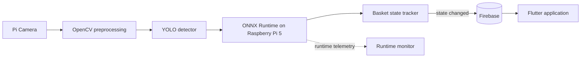
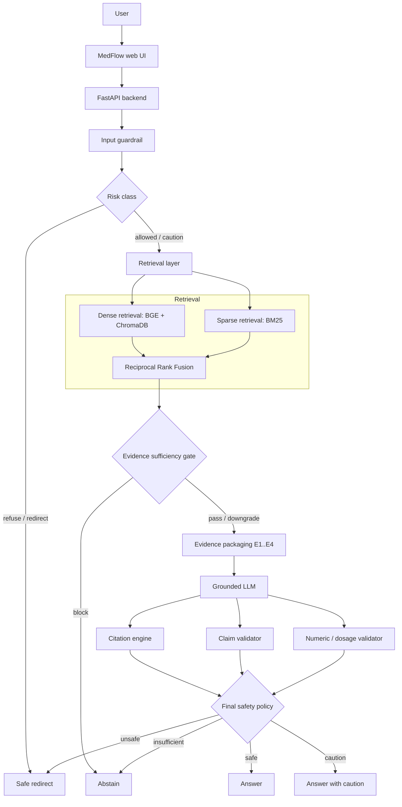
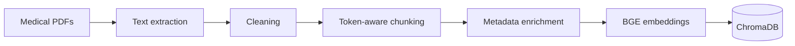
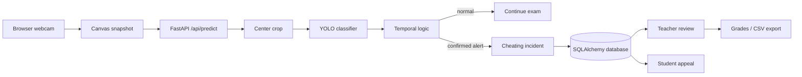
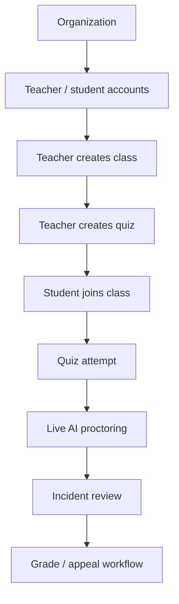
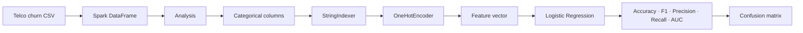
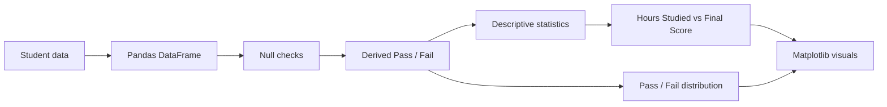

<div align="center">


<a href="https://adhamelsayedai.github.io/"></a>
<a href="https://www.linkedin.com/in/adham-elsayed-"></a>
<a href="https://adhamelsayedai.github.io/Adham_Elsayed_CV.pdf"></a>
<a href="mailto:adhamelsayed515@gmail.com"></a>


</div>

## About

> *Build the model → measure the behavior → connect the architecture → ship the system.*

I'm an **AI Engineer** working across computer vision, edge AI, RAG / LLM systems, model evaluation, and intelligent applications. My strongest work is built around complete systems: the model is one component, while retrieval, validation, inference, APIs, state, and product workflow determine whether the result is actually useful.

```python
class AdhamElsayed:
    role = "AI Engineer"
    location = "Egypt"

    focus = [
        "Computer Vision",
        "RAG / LLM Systems",
        "Model Evaluation",
        "Edge AI",
        "Intelligent Applications",
    ]

    current_systems = {
        "Smart Basket": "edge vision + synchronized retail state",
        "MedFlow": "evidence-grounded RAG + safety validation",
        "Code AI Proctor": "visual inference + auditable exam workflow",
    }

    engineering_loop = "Data → Model → Evaluate → Serve → Product → Iterate"
```

<p align="center">
  <a href="#featured-systems">Featured Systems</a> ·
  <a href="#data--machine-learning">Data / ML</a> ·
  <a href="#technical-stack">Technical Stack</a> ·
  <a href="#evaluation--evidence">Evidence</a> ·
  <a href="#current-focus">Current Focus</a>
</p>

---

# Featured Systems

## 1. Smart Basket — Edge AI Retail System

Real-time retail product recognition running on Raspberry Pi 5, connected to basket-state logic, Firebase synchronization, and a Flutter application.

| | |
|---|---|
| **Repository** | [`Smart-Basket`](https://github.com/AdhamElsayedAI/Smart-Basket) |
| **Stack** | `YOLO` · `OpenCV` · `ONNX Runtime` · `Raspberry Pi 5` · `Firebase` · `Flutter` |
| **Capability** | Edge product detection + stabilized basket state + mobile synchronization |
| **Validation** | `mAP@0.5 = 96.89%` · `mAP@0.5:0.95 = 84.79%` |

### System architecture



**Architecture notes**

- Camera frames are prepared before inference with OpenCV.
- ONNX Runtime moves inference onto Raspberry Pi 5 instead of depending on a cloud model endpoint.
- Basket-state confirmation / hold behavior reduces unstable product-state changes.
- Firebase updates are written when state changes rather than continuously rewriting identical state.
- Flutter consumes the synchronized basket state at the application layer.

[Inspect Smart Basket →](https://github.com/AdhamElsayedAI/Smart-Basket)

---

## 2. MedFlow — Evidence-Grounded Clinical RAG

A thyroid-focused clinical AI prototype where retrieval, evidence sufficiency, generation, citation resolution, claim validation, numeric safety, and final policy are separate system layers.

| | |
|---|---|
| **Repository** | [`Medflow`](https://github.com/AdhamElsayedAI/Medflow) |
| **Stack** | `FastAPI` · `BGE` · `ChromaDB` · `BM25` · `RRF` · `Groq / GPT-OSS` |
| **Capability** | Evidence-grounded answers with traceable citations and explicit safety routing |
| **Retrieval** | `Precision@4 = 53.12%` · `Hit@4 = 87.50%` · `MRR ≈ 0.7031` |

### Runtime architecture



### Offline evidence pipeline



**Architecture notes**

- Dense and sparse retrieval remain separate before fusion.
- Evidence sufficiency can stop generation before the LLM is allowed to answer.
- Citation resolution is deterministic and separated from claim support.
- Numbers, units, dosages, thresholds, and durations receive stricter validation.
- The final policy can answer, caution, abstain, or redirect.

> The reported values are **engineering evaluation metrics**, not clinical validation or a medical-accuracy claim.

[Inspect MedFlow →](https://github.com/AdhamElsayedAI/Medflow)

---

## 3. Code AI Proctor — AI Exam Monitoring Platform

A self-hosted exam platform connecting webcam inference to organization management, quizzes, incident persistence, teacher review, grading, and student appeals.

| | |
|---|---|
| **Repository** | [`code-ai-proctor`](https://github.com/AdhamElsayedAI/code-ai-proctor) |
| **Stack** | `YOLO` · `PyTorch` · `FastAPI` · `SQLAlchemy` · `HTML/CSS/JS` |
| **Capability** | Local visual inference connected to an auditable exam workflow |
| **AI task** | Binary classification: `cheating` vs `normal` |

### Runtime architecture



### Platform workflow



**Architecture notes**

- YOLO inference runs locally with CUDA when available and CPU fallback otherwise.
- Webcam frames are center-cropped before classification to avoid aspect-ratio distortion.
- Batch probability and streak logic reduce single-frame instability.
- Confirmed incidents are attached to the active quiz attempt and persisted for review.
- Teacher notifications, acknowledgement, grading, CSV export, and student appeals extend the system beyond inference.

[Inspect Code AI Proctor →](https://github.com/AdhamElsayedAI/code-ai-proctor)

---

# Data / Machine Learning

## 4. Telco Customer Churn — PySpark ML

Big-data style churn analysis and binary classification using Spark DataFrames and MLlib.

| | |
|---|---|
| **Repository** | [`Telco-Customer-Churn-Project`](https://github.com/AdhamElsayedAI/Telco-Customer-Churn-Project) |
| **Stack** | `PySpark` · `Spark DataFrames` · `MLlib` · `Google Colab` |
| **Task** | Predict whether a telecom customer will churn |
| **Model** | `Logistic Regression` |



[Inspect Telco Churn →](https://github.com/AdhamElsayedAI/Telco-Customer-Churn-Project)

---

## 5. Student Performance Analysis

A compact exploratory analysis connecting study behavior, attendance, previous performance, final score, and pass/fail status.

| | |
|---|---|
| **Repository** | [`Student-Performance-Analysis`](https://github.com/AdhamElsayedAI/Student-Performance-Analysis) |
| **Stack** | `Python` · `Pandas` · `Matplotlib` · `Google Colab` |
| **Focus** | Exploratory student-performance analysis and visualization |



[Inspect Student Performance Analysis →](https://github.com/AdhamElsayedAI/Student-Performance-Analysis)

---

# Technical Stack

### Core AI / ML

`Python` · `PyTorch` · `TensorFlow` · `Scikit-learn` · `YOLO`

### Computer Vision / Edge

`OpenCV` · `ONNX Runtime` · `Raspberry Pi 5` · `Pi Camera`

### RAG / LLM

`BGE Embeddings` · `ChromaDB` · `BM25` · `RRF` · `Grounded Generation` · `Citation Resolution` · `Claim Validation` · `Numeric Safety` · `Guardrails`

### Backend / Data

`FastAPI` · `REST APIs` · `SQLAlchemy` · `Firebase` · `PySpark` · `Spark MLlib` · `Pandas` · `SQLite / SQL`

### Application Layer

`HTML` · `CSS` · `JavaScript` · `Flutter`

---

# Engineering Principles

```text
01  Understand the failure mode before adding complexity.
02  Measure behavior before calling a component better.
03  Tie every metric to its exact evaluation context.
04  Separate retrieval, generation, validation, and product workflow.
05  Prefer inspectable architecture over black-box demos.
06  Move notebook → inference → API → product.
```

---

# Evaluation & Evidence

| Project | Measured / inspectable evidence |
|---|---|
| **Smart Basket** | `mAP@0.5 = 96.89%` · `mAP@0.5:0.95 = 84.79%` |
| **MedFlow** | `Precision@4 = 53.12%` · `Hit@4 = 87.50%` · `MRR ≈ 0.7031` |
| **Code AI Proctor** | Local inference · temporal stabilization · incident persistence · review workflow |
| **Telco Churn** | Accuracy · F1 · Precision · Recall · AUC · Confusion Matrix |
| **Student Performance** | Descriptive statistics · relationship analysis · pass/fail visualization |

---

# Background

| | |
|---|---|
| **Education** | B.Sc. Artificial Intelligence Engineering — Mansoura University |
| **Training** | Digital Egypt Pioneers Initiative — Microsoft AI & Data Science / Machine Learning Engineering track |
| **Location** | Egypt |

<details>
<summary><b>GitHub activity</b></summary>
<br/>
<div align="center">


</div>
</details>

---

# Current Focus

- **Computer Vision & Edge AI** — detection / classification, efficient local inference, model-to-device integration.
- **RAG / LLM Systems** — retrieval quality, evidence sufficiency, grounding, citation and claim validation.
- **Evaluation** — measurable behavior, failure modes, and system-level iteration.
- **AI Product Engineering** — model → API → workflow → usable product.

---

<div align="center">

**Adham Elsayed** · AI Engineer · Egypt

[Portfolio](https://adhamelsayedai.github.io/) · [LinkedIn](https://www.linkedin.com/in/adham-elsayed-) · [Résumé](https://adhamelsayedai.github.io/Adham_Elsayed_CV.pdf) · [Email](mailto:adhamelsayed515@gmail.com)

<sub>Build the model · Measure the behavior · Ship the system</sub>

</div>
